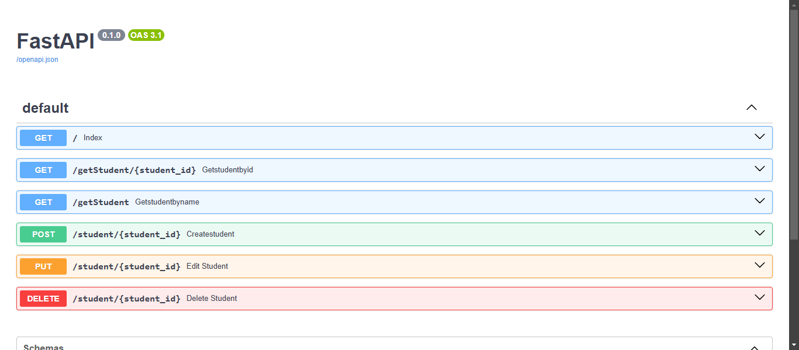

#### Steps to create docker image and run it
- create a dockerfile and list the steps for docker to build the image (refer to the dockerfile in this folder).
- create docker image using the command `docker build -t myapp:1.0.0 .`
    - -t: gets the image name and tag `-t <image-name>:<tag>`
- once docker image is created, we have to run the image using the command
    `docker run -p 8000:8000 myapi:1.0.0`
- we expose the container's 8000 port to our local port 8000 (To access it, we have asked docker to expose container's port 8000 in the dockerfile)
- Now move to localhost:8000/docs to access the swagger of our fastapi
